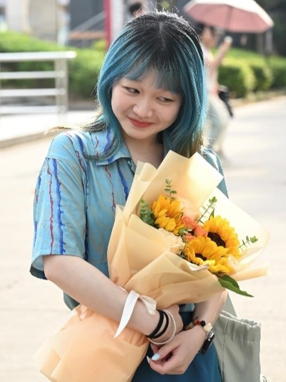
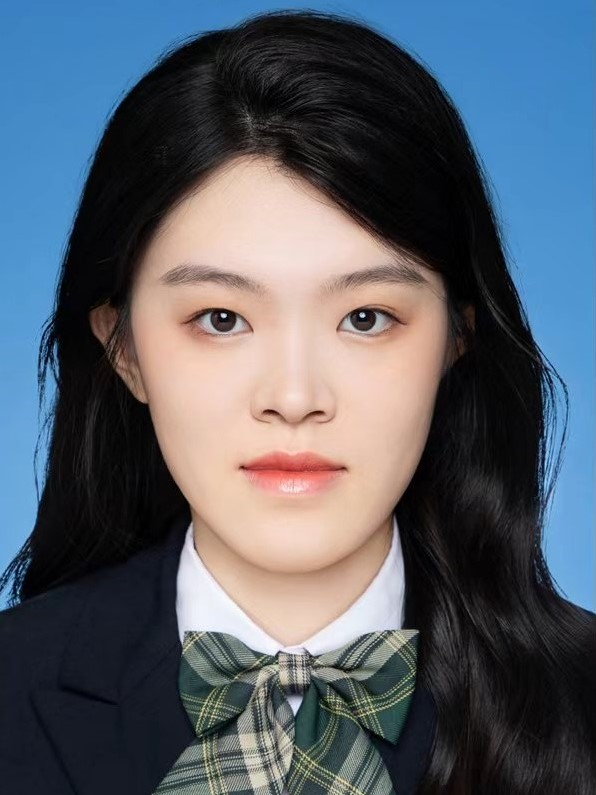

EDUCATION
------
* **Beijing Normal University**, Ph.D. of Journalism and Communication Studies
   Sept 2021 - June 2024
* **MIT Media Lab**, Visiting Scholar
   Sept 2022 - Aug 2023
* **Beijing Normal University**, Master of Communication Studies
   Sept 2019 - June 2021
* **Central South University**, Bachelor of Digital Publishing (Major) and English (Minor)
   Sept 2015 - June 2019

ENGLISH PUBLICATIONS
------
* **Zhang, R**., & Li, B. (2025). Exploring the dynamics of data sharing in open science among Chinese scholars: An integrated PMT and TPB approach. Global Media and China, 0(0). https://doi.org/10.1177/20594364251319562
* **Zhang, R**., & Xu, J\*. (2024). Subjective norm, self-efficacy, and policy acceptance for open communication science. *International Journal of Communication*, 18, 3964-3986  
* Xu, J., & **Zhang, R\***. (2024). Attitudinal, normative, and resource factors affecting communication scholars’ intention to adopt an open science: A replication study. *Media and Communication*, 12, 1-17  
* Zhu, Y., Xu, J.\*, **Zhang, R**., Lan, D., & Jiang, Y. (2024). Prior attitude, individualism and perceived scientists expertise: Exploring motivated reasoning of scientific information about HIV risks of homosexuals in China. *Journal of Media Psychology: Theories, Methods, and Applications*. https://doi.org/10.1027/1864-1105/a000437  
* Jiang, H., Liu, N., Overney, C., **Zhang, R**., Kabbara, J., & Roy, D\*. (2024). Lost in translation: Investigating systematic discrepancies between parallel English and Chinese names of American Chinese restaurants. *Proceedings of the 10th International Conference on Computational Social Science*  
* **Zhang, R**., Gong, J., Firdaus, A., Ma, S., & Xu, J\*. (2023). Automatic coding mechanisms for open-ended questions in journalism surveys: An application guide. *Digital Journalism*, 11(2), 321-342  
* **Zhang, R**., Gong, J., Hou, W., & Xu, J\*. (2022). Is open communication scholarship a promise or peril? Preliminary interviews with qualitative communication scholars. *International Journal of Communication*, 16, 1-20  

CHINESE PUBLICATIONS
------
* 徐敬宏,郭迪帆,<b>张如坤</b>.建设性新闻对受众风险感知与应对的影响研究——以健康传播为例[J].新闻与传播研究,2024,(4):81-95. (Research on the impact of constructive news on audience risk perception and response: Perspective of health communication)
* 徐敬宏,<b>张如坤</b>,郭婧玉,巩见坤.弹幕与规训：网络直播中的性别凝视——基于斗鱼大数据的分析[J].国际新闻界,2022,44(4):146-151+153-167. (Bullet screen and discipline: Gender gaze in webcast based on Douyu Big Data)
* 徐敬宏,<b>张如坤</b>.未来已来：开放科学与定性研究——对30位中国传播学者的深度访谈[J].现代传播(中国传媒大学学报),2022,44(4):11-18. (Communication stepping towards open science: Opportunities, challenges, and future)
* 徐敬宏,<b>张如坤</b>,张世文.建设性新闻的冷思考：中西语境、理论风险与实践误区[J].新闻大学,2020,(6):12-22+122. (Reflecting on constructive journalism: Chinese and western contexts, theoretical challenges and practical concerns)
* 徐敬宏,<b>张如坤</b>.大语言模型和新闻学实证研究：议程、理论与方法[J].当代传播,2024,(1):59-64. (Large language models and empirical research in journalism: Agenda, theory and methods)
* 徐敬宏,<b>张如坤</b>.大语言模型在学术出版应用中的失范风险与应对策略[J].中国编辑,2024,(2):36-42. (Risks and countermeasures in the application of large language models in academic publishing)
* 徐敬宏,<b>张如坤</b>.何以圈粉?“转文化传播”的效果研究——以“洋网红”郭杰瑞为例[J].西南民族大学学报(人文社会科学版),2023,44(7):147-153. (How influencer gain fans? Media effect of "transcultural communication")
* 徐敬宏,<b>张如坤</b>.ChatGPT在编辑出版行业的应用：机遇、挑战与对策[J].中国编辑,2023,(5):116-122. (The application of ChatGPT in the editing and publishing industry: opportunities, challenges and countermeasures)
* 徐敬宏,<b>张如坤</b>.“新闻找到我”：助推高选择性媒体环境下受众的新闻接触[J].编辑之友,2023,(4):49-55. ("News Finds me": Boosting readers' news exposure in a high-choice media environment)
* 徐敬宏,<b>张如坤</b>,朱奕.新冠肺炎疫情报道中建设性新闻的传播效果——基于大学生群体的微信实验[J].当代传播,2022,(4):30-36+47. (Communication effect of constructive news during coronavirus pandemic: WeChat experiment on college students)
* 徐敬宏,<b>张如坤</b>.“介入性”与“客观性”共生:建设性新闻生产实践体系研究——兼与常江教授商榷[J].中国出版,2021,(2):20-26. (Replacing objectivity with intervention? A debate on constructive news production)
* 徐敬宏,<b>张如坤</b>.迈向开放科学的传播学:机遇、挑战与未来[J].编辑之友,2020,(12):76-84. (Communication stepping towards open science: Opportunities, challenges, and future)     

CONFERENCE AND INVITED TALKS
------

    
  

    

      
 • 110th Annual NCA Global Convention, New Orleans, United States (November 2024) [Conference Presentation].
 • 75th Annual ICA Conference, Gold Coast, Australia (June 2024) [Conference Presentation].
 • 72nd Annual ICA Conference, Paris, France (May, 2022) [Conference Presentation].
 • School of Humanities, Central South University, July 12, 2024. "How to Use Large Language Models for Empirical Research in Journalism" [Invited Talk].

    

AWARDS AND HONORS 
------
* Beijing Normal University, Outstanding Graduate; First Class Academic Scholarship, "Academic Innovation Award" in Communication (Grand Prize), Qi Hao Award "Academic Newcomer Award" (5th Edition), "Graduate Academic Award" (Grand Prize)      
  Academic Year: 2022–2023
* Ph.D. National Scholarship; Beijing Normal University "Graduate Academic Innovation Award", First Prize  
  Academic Year: 2021-2022
* Beijing Normal University, Second Class Academic Scholarship 
  Academic Year: 2019-2020
* Undergraduate National Scholarship; Central South University Academic Scholarship; Hunan Province Outstanding Graduate  
  Academic Year: 2017-2018
* Baosteel Outstanding Student Award; Central South University Academic Scholarship; Outstanding Student  
  Academic Year: 2016-2017
* Undergraduate National Scholarship; Central South University Academic Scholarship; Outstanding Student  
  Academic Year: 2015-2016

TEAM MEMBER
------

    
 <b>Yijia Zheng 郑忆佳</b>

    

      
<b>Education</b>
 •	Shenzhen University – Master of Journalism and Communication
 •	Jiangxi University of Finance and Economics – Bachelor of Arts and Law (Dual Degree)
 <b>Research Interests</b>
 •	Network and New Media, Media Effects, Large Language Models, Large Language Models
 <b>Academic Experiences</b>
 •	2023 “SFLEP Cup” National English Debate Contest – Third Prize
 •	2022 “SFLEP Cup” National English Speaking Contest – Second Prize
 •	2021 China International "Internet+" Innovation Competition – School-Level Project

    

 

    
 <b>Yiling Liu 刘奕伶</b>

    

      
<b>Education</b>
 •	Shenzhen University – Master of Journalism and Communication
 •	Tianjin Foreign Studies University – Bachelor of Management

 <b>Research Interests</b>
 •	Intercultural Communication, Media Effects, Social Media Use

 <b>Academic Experiences</b>
 •	4th SFLEP Cup National College Students’ Intercultural Competence contest, School First Prize
 •	University Student Innovation and Entrepreneurship Competition, City-Level Project Approval

    

 

    
 <b>QingQing Xie 谢青青</b>

    

      
<b>Education</b>
 •	Shenzhen University – Master of Journalism and Communication
 •	Ningxia University – Bachelor of Journalism

 <b>Research Interests</b>
 •	New Media Communication, Media Effects, International Communication

 <b>Academic Experiences</b>
 •	2023 Ningxia University Students' Original Literature Competition
 • 2021 Yinchuan New Media Contest-Third prize

    

